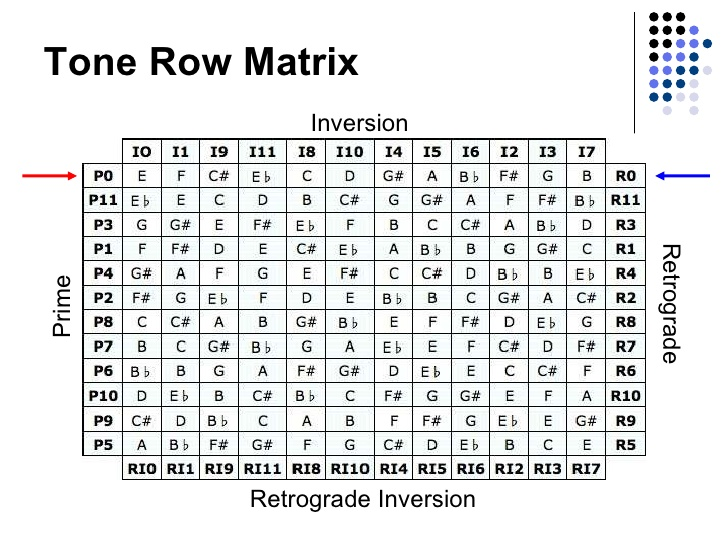
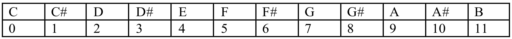
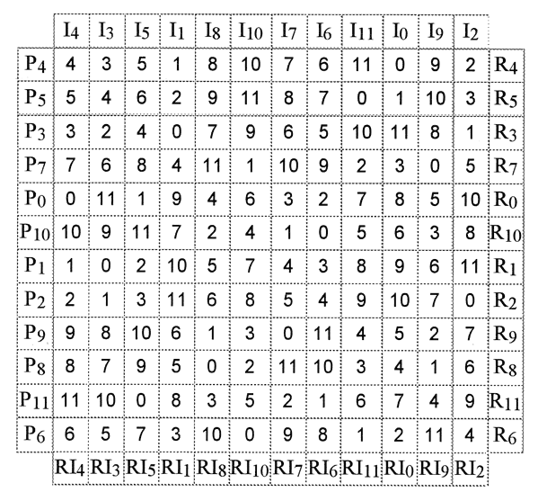

# Mid-Term Project

The mid-term project is an opportunity to take the learnings in the course so far and apply them in a creative context. You will also learn new programming concepts that were not covered in the class so far, such as a 2D array, random number generation, and text file manipulation. You must follow the step-by-step instructions below to complete your mid-term. Make sure to implement all of the TODOs listed in the template files for full credit. 

The submission of your mid-term project must be made on GitHub using your problem set repository. Create a folder named `Mid-TermProject` in your GitHub repository. Inside it, add your c files for the mid-term project. Commit and push your project before the deadline.

Remember that other forms of submission will not be accepted. Consult the instructor if you have issues submitting your mid-term project via GitHub *before* the due date.

## Timeline
Start Date and Time| Due Date and Time | Cut-off Date and Time |
---|---|---|
15:50:00 on October 14, 2021 | 14:00:00 on October 28, 2021 | 14:00:00 on October 28, 2021 |

\**Eastern Standard Time (EST) is used for dates and times with the 24-hour clock.*  
\**No late submission is accepted, except in cases of emergency.*  
\**Extensions are not ordinarily granted, except in cases of emergency.*

## Grading Rubric
Description|Grade
---|---:|
All project files are submitted and have the correct names. | 10%
Clean, understandable, commented, and organized | 10%
No compilation error or warning | 10%
Parameters of the functions provided in the templates are not modified.| 10%
Step 1 fulfills the requirements. | 10%
Step 2 fulfills the requirements. | 10%
Step 3 fulfills the requirements. | 10%
Step 4 fulfills the requirements. | 10%
Your mid-term project is presented in the class, covering all presentation requirements | 10%
Your mid-term project works | 10%
**Total** | **100%**

## Serialism
The mid-term project is about using C to algorithmically compose a piece of music in the `Serialism` style. Serialism uses **twelve-tone row**, or **series**, to create a unique melody, harmony, and tonality rule. The rule of original Serialism is simple: each of the 12 chromatic pitches is presented in order, without repetition, until all 12 are used. Once the series is complete, another series may be used.

The twelve chromatic pitches can be arranged into almost half a billion combinations. The compositional unity is achieved through the **order of intervals**. All tone rows contain the same pitches, but the intervallic structure of a given tone row is unique and unchanged in all its forms. It is essential to understand the 12-tone row is a tool, an abstraction of pitch classes, and is not the music itself. The row provides organic unity, generally subliminal, to a piece of music.

### Step 1: Create Tone Matrix
A tool to analyze a twelve-tone composition is a twelve-tone matrix, which shows all 48-row forms in a 12-by-12 grid. In our case, we will be using the twelve-tone matrix to generate a sequence of notes. Below is an example matrix:



*Image Credit: [University of Oregon](https://klio.uoregon.edu/city/images-berlin-2016/twelve-tone-technique-for-music-composition-6-728.jpg)*

Here, the matrix is displayed using musical notes (C ~ B). The serialism approach works best when musical notes are represented as numbers to apply mathematical operations. For this reason, the musical note representation is often converted to the pitch-class model (0 ~ 11). In the pitch class, a musical note, C, is mapped to 0 while a musical note, B, is mapped to 11. Any other musical notes between the two will be kept within this number range as shown below:

 

When the musical note representation is converted to the pitch-class representation, the twelve-tone matrix will look more like the below:

 

*Image Credit: [Music Theory Online](mtosmt.org)*

Once we have the twelve-tone matrix in the pitch class representation, obtaining row transformation becomes possible with mathematical operations. `P0` (P stands for *Prime*) in the matrix represents the original 12-tone row. For example, if we want to transpose the original row, we would add a number between 1 and 11 to each row element and perform a `modulo 12` operation afterward to map the result back into the range 0 ~ 11. The result of transposition is listed between P1 ~ P11 in the matrix. There are three other ways in which the tone row can be altered:

- **inversion:** reversing the direction of all intervals within the row. Read from top to bottom of the Matrix (I0, I1, etc.). An inversion for I0 centers around the first note in P0. For example, if the first note is 0 and the second note in P0 is 3, the second note in I0 will be 9.
- **retrograde:** reversing the order of pitches in the row. Read from right to the left of the Matrix (R0, R1, etc.).
- **retrograde inversion:** an inversion played in reverse order. Read from the bottom to the top of the Matrix (RI0, RI1, etc.).

As you can see, all of the above transformations can be retrieved by reading the matrix from different directions. Try [this twelve-tone matrix calculator](https://www.musictheory.net/calculators/matrix) to learn how it works interactively.

#### Steps to generate a Tone Matrix
1. Start with the template file `01.ToneMatrix.c` in the `Templates` folder. Do not change the file name.
2. In the main function, ask the user to enter the size of the tone row (a tone matrix does not always have to be size 12. e.g., microtonal scales.).
3. Based on the user input, allocate the memory space for the matrix. This matrix should have enough memory space to hold the *square* of the tone row size entered. 
4. Initialize the matrix's first row (P0) by implementing the `initFirstRow()` function.
	- The `initFirstRow()` function takes two inputs, the address of the `matrix` and `row size`.
	- Randomly populate the first row of the matrix using the `shuffle` function provided in the template.
	- Alternatively, you can ask the user to enter each tone up to the row size, one at a time.
5. Generate the rest of the matrix based on the first row by implementing the `generateMatrix()` function.
	- The `generateMatrix()` function takes two inputs, the address of the `matrix` and `row size`.  
	- Get the inversion of `P0` and populate the value in `I0` first.	- Fill out the rest of the primes (P1 ~ P11) based on the `I0` by transposing the values in `P0`.

#### Indexing a Matrix
- The `matrix` variable is allocated as an array, but you must treat it as a 2D array in your program.
- 2D arrays can be defined as arrays within an array, and 2D array structures as a matrix. 
- Matrix is a combination of *rows* and *columns*.
- Using a nested for-loop, we can iterate and access each element in the matrix:

```c
for (int row = 0; row < rowSize; row++)
{
	for (int column = 0; column < rowSize; column++)
	{
	  printf("%d\n", matrix[row * rowSize + column]);
	}
}
```

- Pay attention to this indexing method as you will need it again in the future steps.

#### Finishing up
- The `01.ToneMatrix.c` file will automatically save your tone matrix in the `matrix` variable into a text file named `matrix.txt` at the end of the program.
- Check out the `saveMatrix()` function to learn how a text file saving in C works.
- Before the program exits, make sure to free all the memory space you allocated yourself.
- Try comparing the result with the output of the example executable file named `01.ToneMatrix` in the `ExampleExecutables` folder.
- You can also check the example `matrix.txt` file in the `ExampleFileOutputs` folder to compare with yours to see if the file saving worked correctly. 

### Step 2: Traverse Tone Matrix
Start with the `02.TraverseMatrix.c` template file for this step (Keep the file name as is). In this step, your job is to interactively ask the user how they want to create their tone series based on the matrix generated and saved in the `matrix.txt` file in step 1. The template is already designed to open the `matrix.txt` file saved from the previous step. It will read the values in the file and store them into the `matrix` variable. For this reason, make sure that the `matrix.txt` file is in the same directory as your `02.TraverseMatrix.c` file.

#### Steps to traverse Tone Matrix
1. Repeatedly ask the users which transformation mode they want using a while-loop—1 for prime, 2 for Invert, 3 for Retrograde, and 4 for Regrograde Invert. 
2. If the user enters 0, your program should quit. 
3. If the number is larger than 4, then the program should ask the user again for the transformation mode.
4. After the users select modes 1 ~ 4, ask them which row they want to traverse next. 
5. If the row number is bigger than the row size, ask the users again until they enter a value lower than the row size. You may use the [`do...while`](https://www.tutorialspoint.com/cprogramming/c_do_while_loop.htm) loop for this step.
6. If the row number is negative, use the `randomWalk()` function to decide which row to traverse. In this case, the absolute value of the negative row number should become the step size for the `randomWalk()` function. For example, if the user type in `-5` for the row, 5 should become the step size for the `randomWalk()`.
7. Once the users have entered the mode and row for traversal, go through each value in a row using one of the four functions, `getPrime()`, `getInvert()`, `getRetrograde()`, or `getRetrogradeInvert()` depending on which mode the users asked. 
8. Use the `append2File()` function to write each value in a row one at a time. The `append2file` function will automatically append new values at the end of the `series.txt` file. An example `series.txt` file is provided in the `ExampleOutputs` folder for your reference.

Try the example executable file named `02.TraverseMatrix` in the `ExampleExecutables` folder to understand what the program you are asked to create does. 

#### Indexing Matrix from Different Directions
To index our 1D array matrix as a 2D array, we want to use the following indexing mechanism:

```c
matrix[row * rowSize + column];
```

In the case of the prime mode, the `column` variable is the index at which we want to access values. For prime traversal, the indexing should be straightforward: the `row` variable represents the row number that the user asked. We can go through each value in the row by incrementing `column` up to the `row size - 1`. 

In the retrograde mode, we decrement the `column` variable instead. We can use similar indexing mechanisms for the invert and retrograde invert modes where the row and column positions may be swapped.

#### Random Walk
Random walk is a random process that describes a path that consists of a succession of random steps in some mathematical space, such as the integers. In Max, the [`drunk`](https://docs.cycling74.com/max8/refpages/drunk) object implements a random walk. Consider the random walk of a drunk person who repeatedly stands up and stumbles off in an independent random direction, falls, and starts again and again. Where the drunk was a moment ago determines the possible places s/he will fall next, so there is a sense of history, but a quixotic one, to the process. 

In our `randomWalk()` function, the `value` entering the function represents the previous value. The function generates a new random number based on this previous value and assigns this new random value back into the `value` variable using the pointer mechanics. If the `randomWalk()` is being called for the first time, you can set the previous value to be 0 or any other value you wish to start from.

The `maxStep` variable is used to tell the `randomWalk()` function the limit on the size of random steps taken. You should randomly generate a `step` size based on `maxStep`. Use the `randomInt()` function provided in the template.

The `size` variable is used to ensure the `randomWalk()` function remains in the range of 0 ~ size - 1. The output of `value` should never be negative and go above size - 1.

Your `randomWalk()` function should be able to generate a new random number in both positive and negative directions. For example, if the previous value is 1, the max step size is 1, and the size is 4, the next value from the `randomWalk()` should either be 0 or 2. Your `randomWalk()` should never generate the same value as the previous value. 

### Step 3: Mapping Tone Sequence
Now that we have generated a tone sequence in the `series.txt` file, we will create a mapping table that takes the series and maps it to the parameters of the MIDI note message. This step aims to translate the tone sequence to data that the `coll` object in Max can understand. You should playback your tone sequence using `Playback.maxpat` included in the project template for this step (Use the `melody` section). The `coll` object is designed to work with the `makenote` object in this patch. The `makenote` object takes three inputs: pitch, velocity, and duration. For this reason, the data in the coll object is designed to feed these three inputs to the `makenote` object. 

Here is an example of how a mapping system can work. Assume that we have generated a tone sequence:

```
0 2 1 3 1 3 2 0
```

From this sequence, we can see that the range is between 0 ~ 3. We could use these values as indices in an array. For example, suppose we want to map these values to velocities. In that case, we could prepare an array of size 4 with predetermined velocity values:

```c
int velocities[4] = {0, 50, 100, 127};
```

If we use the tone sequence above as indices into the `velocities` array, we will get:

```
0, 100, 50, 127, 50, 127, 100, 0
```

Your job in this step is to create this kind of mapping system with pitch, velocity, and duration information that will enter Max's `makenote` object. The pitch and velocity value should be constrained between 0 ~ 127. The duration value should be based on the [time value syntax for ticks and note values in Max](https://docs.cycling74.com/max8/vignettes/maxtime_syntax). As a requirement, you must use the `Note` structure provided in the `03.MappingToneMatrix.c` template file for mapping:

```c
typedef struct Note {
  int pitch;
  int velocity;
  char *duration;
} Note;
```

#### Steps to map your Tone Matrix
1. Create a mapping table (array) for pitch, velocity, and duration using the `Note` structure.
2. Check to make sure that the table size is at least the size of the row in the original matrix using the output of the `getSize()` function. 
3. Allocate enough memory space to hold all tone values in `series.txt`. The readSeries() function will then read all the values in the `series.txt` file.
4. Map the series array to the mapping table.
5. Write the result to `notes.txt` by calling the `append2File()` function.

The `append2File()` function is designed to take a Note struct and append the pitch, velocity, and duration values into the `notes.txt` file. Check to ensure that the `coll` object can read and playback the contents of the `notes.txt` file in the `melody` section of the max patch. You will need to rename the `notes.txt` to `melody.txt` for the `coll` object to read the file.

Try the example executable file named `03.MappingToneMatrix` in the `ExampleExecutables` folder to understand what the program you are asked to create does. You can also check the content of the `melody.txt` file in the `ExampleFileOutputs` folder for an example output.

### Step 4: Composing with Tone Matrix
Now that we have a mechanism to generate tone sequence for the Max patch, expand your composition by generating more melody, bassline, drum, chord, etc. The `Playback.maxpat` file contains two more tracks for bass and drum. Generate at least two more tone sequences for these two tracks based on the same tone matrix generated in step 1. You may want to generate a different tone series using the programs in step 2 or the mapping system from step 3 to generate the two tracks. 

You may modify the max patch provided in the template file, but you will not be graded for any changes you make in the patch. Spend more time refining your tone matrix generation system for this reason. Some parameters to consider changing in the Max patch are the beat for each track (4n, 8n, etc.) and transposition values. In particular, with drum, you may want to refer to the percussion keymap listed in [this website](https://www.midi.org/specifications-old/item/gm-level-1-sound-set) for choosing which instrument to play. 

### Step 5: Presentation
You will present your mid-term project on week 8, when the project is due. You will be required to demo your project (Step 1 ~ 4) during your 8 minutes presentation. Suppose you are afraid that the live demo may not work during your presentation. In that case, you may want to consider videotaping your max patch in action before. *Bring your laptop* to present your mid-term project.

#### Presentation Requirements
- Your presentation
	- introduces the audience to the ideas for the composition;
	- demonstrates the composition created with your tone matrix; 
	- walks the audience through the codes you wrote in each step;
	- concludes with your thoughts on the learning experience and possible future work.

---  
**EP-353: Audio Programming in C**   
Electronic Production and Design  
Berklee College of Music  
*Fall 2021*